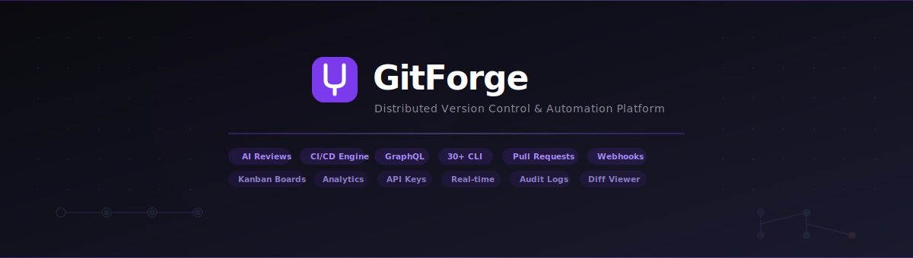

<p align="center">
  
</p>

<p align="center">
  A production-grade version control platform with a built-in CLI, pull requests, code snippets, webhooks, and real-time collaboration.
</p>

<p align="center">
  
  
  
  
</p>

---

## What is GitForge?

I built GitForge as a full-stack alternative to GitHub — not just the web UI, but also a **30+ command CLI** that works like Git with local versioning and cloud sync through MongoDB.

The idea was to understand how platforms like GitHub actually work under the hood — from JWT auth and webhook delivery to real-time Socket.IO events and branch management.

**What makes it different:**
- The CLI and web platform share the same database, so you can `push` from terminal and see it on the dashboard
- Code Snippets work like GitHub Gists but support multi-file, stars, forks, and view tracking
- Webhooks are HMAC-signed with delivery logs — not just fire-and-forget
- There's a command palette (Ctrl+K) for quick navigation, which most platforms don't have

---

## Features

**Web Platform**
- Repos (create, star, fork, visibility toggle), Issues (create, close/reopen, filter), Pull Requests (create, review, merge)
- Code Snippets — multi-file sharing with language tags, star/fork/view counts
- Webhooks — 13 event types, HMAC-SHA256 signatures, delivery logs
- Bookmarks, Milestones, Labels, Comments with reactions
- Search across repos, issues, and users
- Admin dashboard with platform analytics and system health
- Notifications (real-time via Socket.IO + persistent with polling)
- Dark/light theme, responsive layout, keyboard shortcuts
- Command palette (Ctrl+K) for instant navigation

**CLI (30+ commands)**
- Core: `init`, `status`, `add`, `commit`, `push`, `pull`, `clone`
- Branches: `branch`, `checkout`, `switch`, `merge`, `branch-create`, `branch-delete`
- History: `log`, `shortlog`, `reflog`, `show`, `diff`, `blame`, `grep`
- Tags: `tag`, `tag-list`, `tag-delete`, `tag-show`
- Stash: `stash`, `stash-pop`, `stash-list`, `stash-drop`
- Advanced: `revert`, `reset`, `cherry-pick`, `archive`, `clean`, `restore`

---

## Tech Stack

| | |
|---|---|
| **Frontend** | React 18, Vite 5, React Router, Axios, Socket.IO Client |
| **Backend** | Node.js, Express 4, Mongoose 8, Socket.IO 4, Yargs |
| **Database** | MongoDB Atlas (12 collections, compound + text indexes) |
| **Security** | JWT, bcrypt, Helmet, rate limiting, input validation, HMAC webhooks |
| **Testing** | Jest + Supertest (backend), Vitest + Testing Library (frontend) |
| **DevOps** | Docker, docker-compose, Nginx, GitHub Actions, Vercel, Railway |

---

## Getting Started

```bash
# Clone
git clone https://github.com/AradhyaStuti/GitForge-Distributed-Version-Control-Automation-Platform.git
cd GitForge-Distributed-Version-Control-Automation-Platform

# Setup env
cp backend-main/.env.example backend-main/.env
# Fill in MONGODB_URI and JWT_SECRET_KEY

# Install
cd backend-main && npm install
cd ../frontend-main && npm install

# Run (two terminals)
cd backend-main && npm start          # API on :3000
cd frontend-main && npm run dev       # UI on :5173
```

Open **http://localhost:5173** and create an account.

**Docker:**
```bash
docker-compose up --build
```

---

## CLI Usage

```bash
cd backend-main

node index.js init
node index.js add-all
node index.js commit "first commit"
node index.js push
node index.js log
node index.js branch-create feature
node index.js checkout feature
node index.js merge feature
```

---

## API

40+ endpoints. Full interactive docs at `/api/v1/docs` (Swagger).

Key routes:
- `POST /signup`, `POST /login` — auth
- `POST /repo/create`, `GET /repo/all` — repos
- `POST /issue/create`, `GET /issue/all` — issues
- `POST /pr/create`, `POST /pr/:id/merge` — pull requests
- `POST /snippet/create`, `GET /snippets` — code snippets
- `POST /webhook/create`, `GET /webhook/:id/deliveries` — webhooks
- `GET /search?q=query` — full-text search
- `GET /admin/analytics` — platform metrics
- `GET /health` — system health

---

## Project Structure

```
backend-main/
├── controllers/    12 controller files
├── services/       13 service files (business logic)
├── models/         12 Mongoose schemas
├── routes/         12 route files
├── middleware/      7 middleware (auth, validation, cache, rate limit...)
├── __tests__/       7 test suites
└── index.js         server + 30-command CLI

frontend-main/src/
├── components/     18 page components + shared UI
├── hooks/           5 custom hooks
├── api.js           Axios instance with auth interceptor
└── Routes.jsx       18 lazy-loaded routes
```

---

## Architecture Decisions

- **Service layer** separates business logic from controllers — controllers are thin wrappers
- **Async error handling** via `asyncHandler()` + custom `AppError` class — no try/catch in controllers
- **Webhook delivery** uses HMAC-SHA256 signing with 10s timeout and stores last 50 deliveries
- **In-memory cache** with ETag support and configurable TTL for expensive queries
- **All routes lazy-loaded** with React.lazy + Suspense for fast initial load
- **CSS variables** for theming — single source of truth for colors, spacing, radii, shadows

---

## Security

- JWT tokens (24h expiry) + bcrypt (12 rounds)
- Account lockout after 5 failed logins (15min)
- Rate limiting: 100 req/15min global, 15/15min on auth
- Input validation on every endpoint (express-validator)
- Helmet for HTTP security headers
- CORS whitelist (configurable, all localhost in dev)
- Webhook payloads signed with HMAC-SHA256

